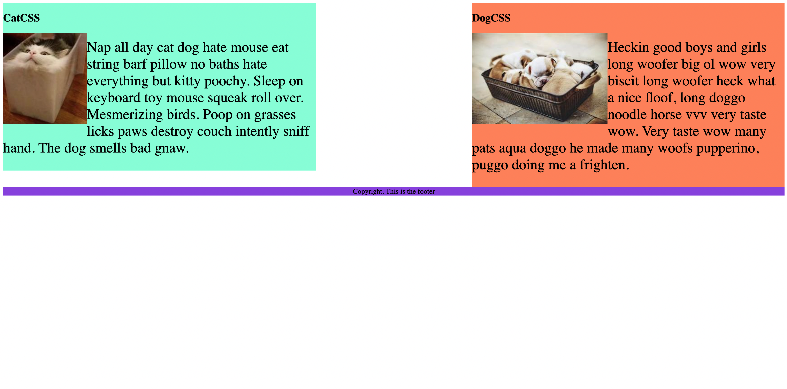

# CSS Float

The goal of this project was to utilize CSS Float to build this oriented webpage with a paragraph on the right and left, and a footer. All within the HTML style element.

## My Answer

